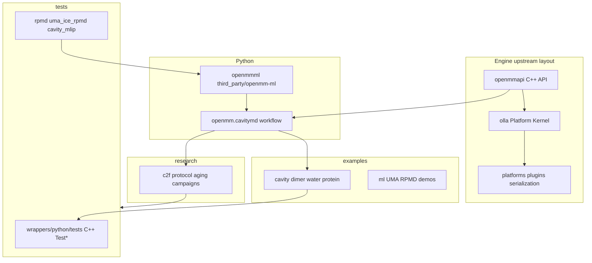

# OpenMM-LM architecture

High-level map of this fork relative to upstream OpenMM.

## Layer diagram

## Module notes

### Cavity physics (core)

- Headers: `openmmapi/include/openmm/CavityForce.h`, `CavityParticleDisplacer.h`
- Implementations: `openmmapi/src/`, platform kernels under `platforms/`
- Serialization: `serialization/`

### Python workflow (`openmm.cavitymd`)

Controllers, thermostats, adaptive coupling, calibration, and simulation helpers used by
demos and `research/c2f/run_c2f.py`. Public API is intentionally small; see
[`wrappers/python/openmm/cavitymd/README.md`](../../wrappers/python/openmm/cavitymd/README.md).

### ML + RPMD

- `third_party/openmm-ml/` — FairChem/UMA/AIMNet integration (`pixi run -e ml install-ml`)
- `plugins/rpmd/` — ring-polymer plugin and hybrid classical–quantum paths
- Parity and regression tests under `tests/rpmd/` and `tests/uma_ice_rpmd/`

### Research workflows

Paper-scale code under `research/c2f/` (moved from `examples/cavity/c2f_protocol/`).
Campaign outputs are not versioned; see [`research/README.md`](../../research/README.md).

## Related docs

- [BUILD_AND_REINSTALL.md](../BUILD_AND_REINSTALL.md)
- [FIXES_SUMMARY.md](../../FIXES_SUMMARY.md) — RPMD/UMA regression context
- [plugins/rpmd/HYBRID_RPMD.md](../../plugins/rpmd/HYBRID_RPMD.md)
